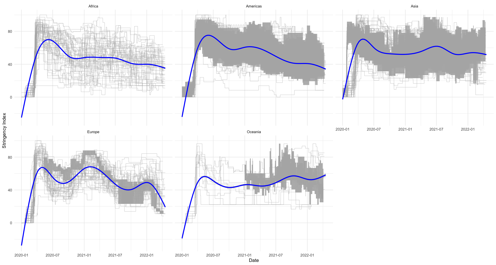
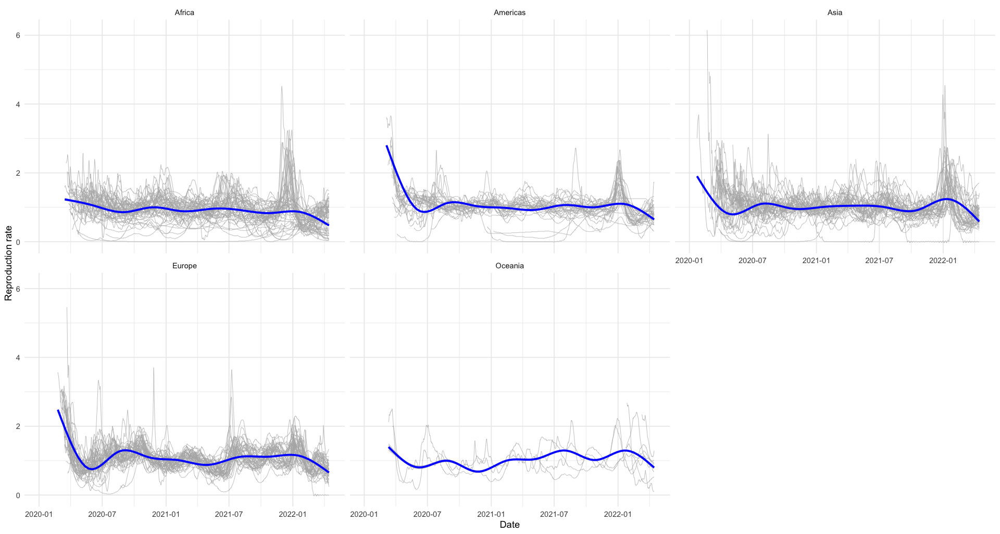
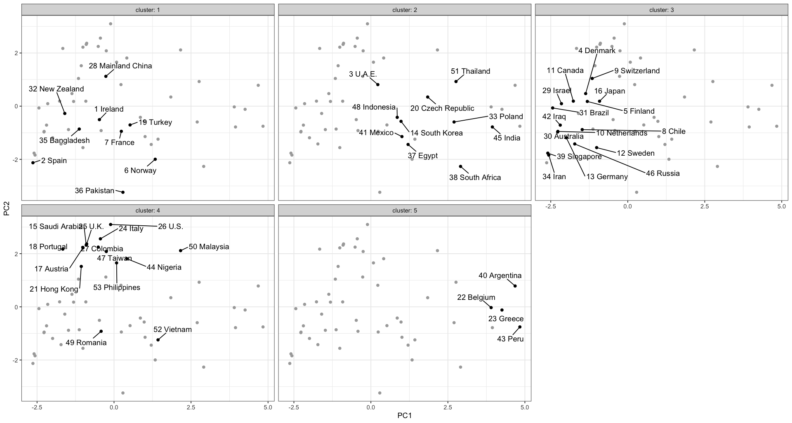
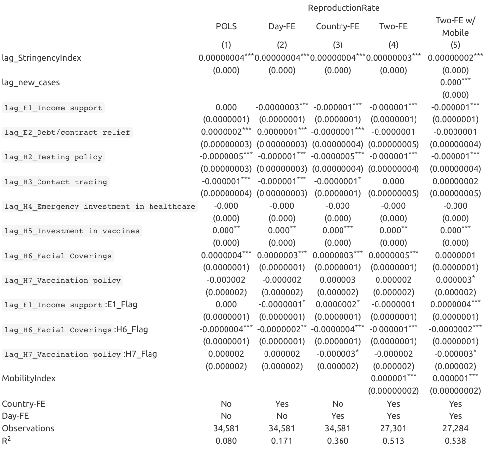
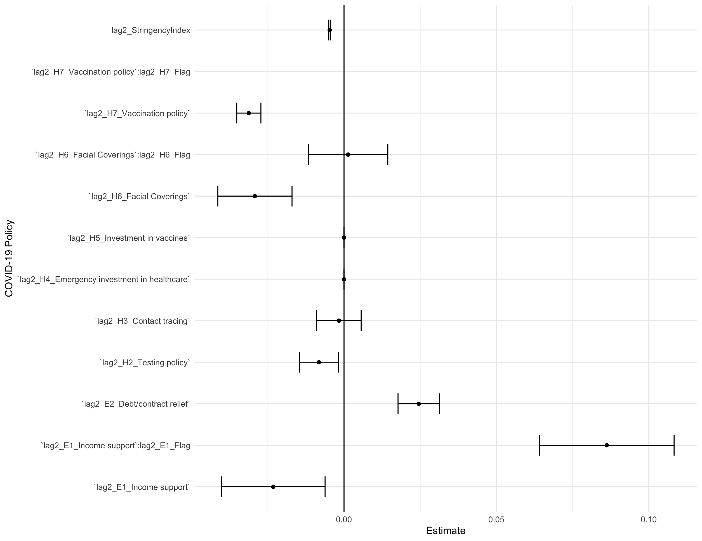
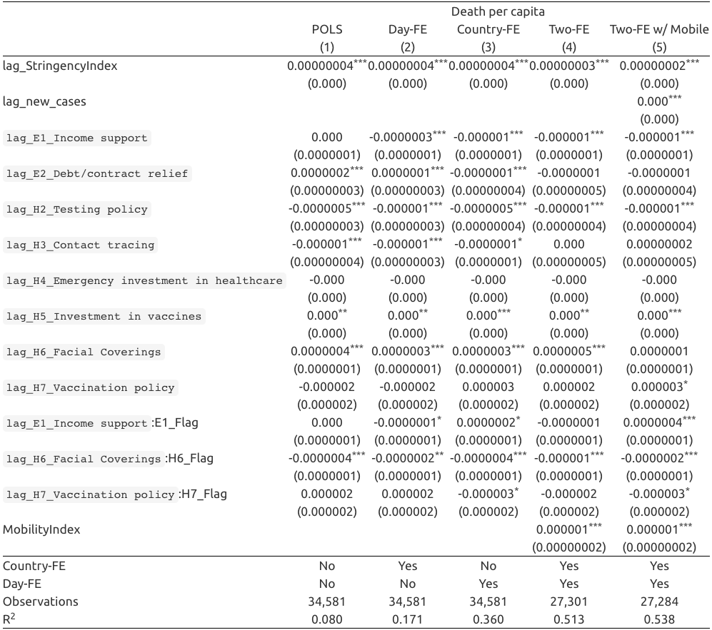
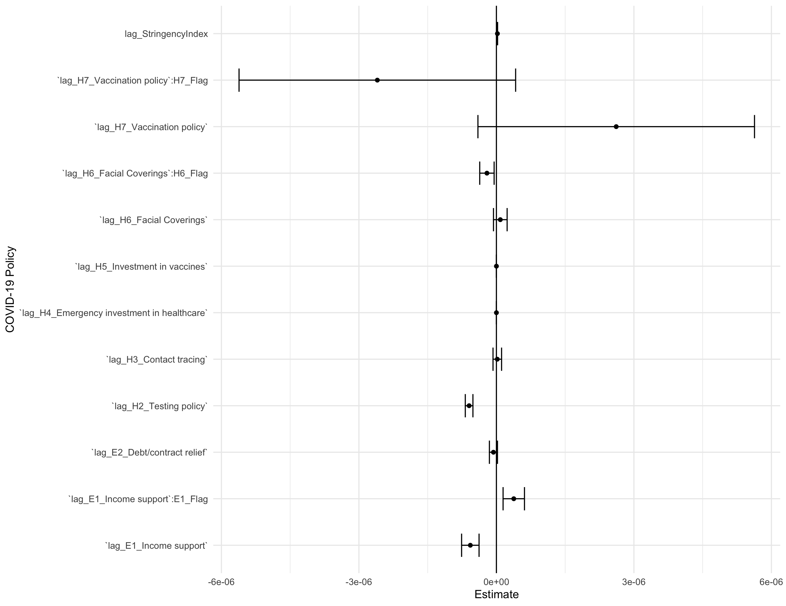

# Introduction

<br>

## Motivation for the Project
Our motivation for the project was mostly attributed to the Business Analytics Competition at Manhattan College. As we know, the Covid-19 pandemic impacted people across every inch of the world. By looking at different country's government response to the pandemic, we can look at how the country fared and see what policies were effective. Over the past two years, COVID-19 has filled hospitals worldwide and taken countless lives in the process. We want to look at the data to:


* Find trends in government responses in response to the pandemic.

* Discover factors that contribute to COVID-19 deaths.

* Explore the reproductive rate of the virus.

<br>


We are going to make visualizations using ggplot, shiny, and others to increase the readability of our findings. It is important to become educated on the factors that affect Covid-19 deaths in the event another global pandemic becomes present. We hope to display trends that may not be apparently obvious in the hopes that this will aid in the current pandemic and future health problems to come.

<br>

## Overview of Modeling Techniques
**Clustering Analysis:** Grouping data with similar outcomes. More specifically, we wanted to discover countries that had similar government responses to the Covid-19 pandemic.

<br>

**Principal Component Analysis:** The principle components (PCs) describe the hyperellipsoid in N-space that roughly bounds the data.

 

<br>

**Pooled Ordinary Least Square:** Normal linear regression model fitted using the OLS technique on a flattened version of the panel data set. 

<br>

**Fixed Effect Linear Regression:** Statistical regression model which is useful for working with panel data. Panel data allows us to control for variables that we cannot observe or measure such a cultural factors or differences in social norms across countries.

<br>

# Data 
For our data analysis, we are utilizing two large datasets. The first is provided by Oxford titled Oxford COVID Government Response Variables. The second dataset is provided by Bloomberg, for which they have created resiliency scores for the 53 top economies in the world.

On top of these two main datasets, we will also be utilizing the Google COVID-19 Community Mobility Report to aid in our regression and analysis process.

```{r, echo=FALSE, collapse=TRUE, warning=FALSE, message=FALSE}
library(readxl)
library(tidyverse)
library(skimr)
library(rstatix)

```

<br>

## Oxford's Data
```{r, echo=FALSE,collapse=TRUE, warning=FALSE, message=FALSE}
#Path name for the dataset
oxford <- "https://raw.githubusercontent.com/OxCGRT/covid-policy-tracker/master/data/OxCGRT_latest.csv"

#Read csv file
oxford <- read_csv(oxford)
oxford <- rename(oxford, country = CountryName)

rmarkdown::paged_table(oxford)
```

<br>

Oxford’s goal is to track COVID-19 policy data consistently and use it to compare policy responses to COVID-19.

They collect data on 180 different countries and 23 different indicators.

The data collection began on January 1st, 2020 which marks the very early stages of the global pandemic.

<br>

### Indicators Utilized
There are 21 live indicators that are imputed into the dataset daily.

**Containment and Closure Policies**: Marked as C1-C8 on the dataset.

**Economic Policies**: E1-E4

**Health System Policies**: H1-H8

**Vaccine Policies**: V1-V4

<br>

### Data Types

There are five kinds of data utilized in the dataset.

**Ordinal**: On a simple scale of severity.

**Numeric**: Specific number typically in U.S. dollars.

**Text**: An open ended free response.

**Categorical**: Range of eligible options to select and occasionally rank.

**Binary**: Present (1) or absent (0).

<br>

### Policy Indices 

**Overall Government Response Index**: 
  Calculated using ordinal indicators
  
**Containment and Health Index**: 
  Combines lockdown restrictions and closure measures with health variables such as testing policy, contact tracing, and others. 
  Calculated using all ordinal containment and closure policy indicators and health system policy indicators.
  
**Stringency Index**: 
  Measures the strictness of lockdown style. 
  Calculated using all ordinal containment and closure policy indicators, plus an indicator recording public information campaigns.

**Economic Support Index**: 
  Measures income support and debt relief. 
  Calculated using all ordinal economic policy indicators
  
**Risk of Openness Index**:
  Based on the recommendations set out by the World Health Organization of measures that should be put in place before COVID-19 response policies can be safely relaxed.

<br>

### Calculation of Policy Indices


Policy indices are averages of the individual component indicators.

$\textit{index} = \dfrac{1}{k}\sum_{j=1}^{k} I_{j}$

Where $k$ is the number of component indicators in an index and $I_{j}$ is the sub-index score for an individual indicator.
  
<br>

### Relation between National and Sub-National Data 
So far, Oxford has incorporated data for Brazilian states, Canadian provinces and territories, Chinese provinces, UK developed nations, and U.S. States.

3 main usage for the OxCGRT data:

  1. Describe all government responses relevant to a certain country
  
  2. Describe policies put in place by a given level and lower levels of government
  
  3. Compare government responses across different levels of government

<br>

### Summary Statistics
```{r, echo=FALSE,collapse=TRUE, warning=FALSE, message=FALSE}
rstatix::get_summary_stats(oxford, type = "robust")
```

<br>

### Stringency Index Across Countries
````{=html}
<style>iframe{height: 600px; width: 800px}</style>
<iframe height="100%" width="100%" frameborder="no"
src="https://jjrappazzo.shinyapps.io/HomeworkApp/">
</iframe>
```` 
## Bloomberg's Data
```{r, echo=FALSE,collapse=TRUE, warning=FALSE, message=FALSE}

#Path name for the dataset
country_info <- "https://covid.ourworldindata.org/data/owid-covid-data.csv"


#Read csv file
country_info <- read_csv(country_info)
country_info <- country_info %>% 
  rename(country = location ) %>% 
  select(country, everything())

rmarkdown::paged_table(country_info)
```

<br>

### Bloomberg Covid Resiliency

They have created resiliency rankings for the world's largest 53 largest economies.
Country Rank is based on their success with controlling the virus with the least amount of social economic disruptions.

<br>

**Reopening Group**: Vaccine Doses Per 100 People, Lockdown Severity, Flight Capacity, and Vaccinated Travel Routs.

**Covid Status Group**: 1-Month Cases per 100k, 3-Month Case Fatality Rate, and Deaths Per 1 Million.

**Quality of Life Group**: Community Mobility, 2022 GDP Growth Forecast, Universal Healthcare Coverage, Human Development Index.

<br>

### Methods

**How the Rankings are aggregated:**
They used the "Max-Min" method where 100 indicates the best performance and 0 indicated the worst.
The final score is determined by averaging the country's performance across all 12 indicators. With equal weight.

<br>

### Summary Statistics
```{r, echo=FALSE,collapse=TRUE, warning=FALSE, message=FALSE}
rstatix::get_summary_stats(country_info, type = "robust")
```
 

# Conceptual Framework 

<br>

## Variation in Government Response
 


<br> 

The graphs shown are representative of government stringency. The Gray lines represent each individual country’s government stringencies, and the blue is the trend line for the entire continent. As you can see, Africa, the Americas, and Asia all had similar negative trends regarding stringency. Europe did not follow this trend, as stringency fluctuated greatly over time. In Oceania, government stringency has steadily increased since late 2021 going into 2022.

<br>



<br>

We grouped the data by continent to emphasize the differences in reproduction rate around the world as the pandemic went on. We can see, for example, when comparing the Americas to Asia in January of 2022 the reproduction rate in Asia was much higher than that of America. This can be due to many different factors, but it may be due to level of government trust or differences in policy.

<br>
 

# Models

<br>

## Clustering Using Pricipal Component Analysis
Utilizing **Bloomberg's data**, we used clustering analysis to discover governments that had similar responses.
We used **Principle Component (PC) Analysis** to characterize twelve Bloomberg indices into the two PCs that best explain the variance of the Bloomberg indices.

<br>

## Reproduction Rate Linear Regression

<br>

$\textit{ReproductionRate}{_i}{_t} = \beta{_0} + \beta{_1}*GovernmentPolicies{_i}{_t} + \upsilon{_i} + \lambda{_t} + \epsilon{_i}{_t}$

<br>

**Where:**

$\upsilon{_t} = \text{Country Fixed Effect}$

<br>

$\lambda{_t} = \text{Daily Fixed Effect}$

<br>

$\epsilon{_t} = \text{Error Term}$

<br>

## Death Per Capita Linear Regression

<br>

$\textit{DeathPerCapita}{_i}{_t} = \beta{_0} + \beta{_1}*GovernmentPolicies{_i}{_t} + \upsilon{_i} + \lambda{_t} + \epsilon{_i}{_t}$

<br>

**Where:**

$\upsilon{_t} = \text{Country Fixed Effect}$

<br>

$\lambda{_t} = \text{Daily Fixed Effect}$

<br>

$\epsilon{_t} = \text{Error Term}$

<br>

## Description of Government Policy Variables

**lag2_StringencyIndex**: 

**lag2_E1_Income support**:

**Lag2_E1_Flag**:

**lag2_E2_Debt/contract relief**:

**lag2_H2_Testing policy**:

**lag2_H3_Contact tracing**:

**lag2_H4_Emergency investment in healthcare**:

**lag2_H5_Investment in vaccines**:

**lag2_H6_Facial Coverings**:

**lag2_H6_Flag**:

**lag2_H7_Vaccination policy**:

**lag2_H7_Flag**:

**lag2_E1_Income Support:lag2_E1_Flag**:

**lag2_H6_Facial Coverings:lag2_H6_Flag**:

**lag2_H7_Vaccination policy:lag2_Hy_Flag MobilityIndex**:
# Results

<br>

## Clustering Analysis Results



<br> 

This is the result of clustering on the Data. The X axis is representative of PC1, and the Y axis is representative of PC2

The value of PC1 is negatively correlated with vaccine doses per 100, and healthcare coverage. PC1 is positively correlated with 3-month case fatality rate.

PC2 is negatively correlated with flight capacity, and vaccinates travel roots, while it is positively correlated with 2021 GDP Growth Forecast.

Cluster 5 shows countries who had low vaccine doses per 100 and healthcare coverage, which is shown by PC1, and had moderate GDP growth forecast, which is shown by PC2.

<br>

## Linear Regression Results

<br>

### Reproduction Rate Results




<br>



### Death Per Capita Results



<br>


 

# Discussion

discussion on the main findings from the machine learning models
 

# Conclusion

## brief summary of the research
## limitation of the research
## future direction of the research


