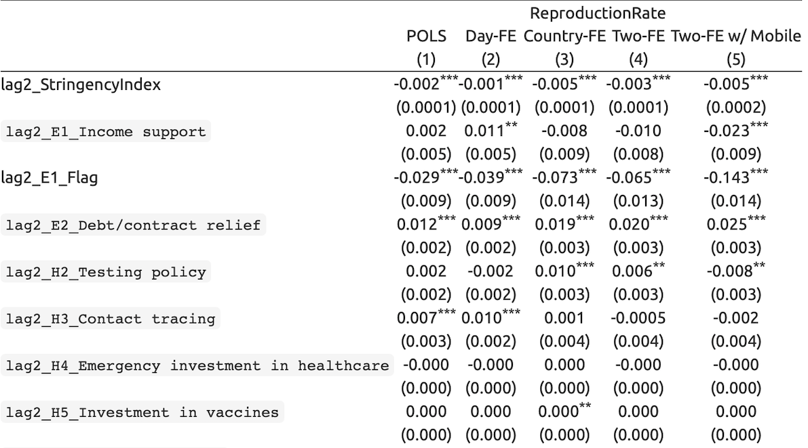

# Introduction

<br>

## Motivation for the Project
Our motivation for the project was mostly attributed to the Business Analytics Competition at Manhattan College. As we know, the Covid-19 pandemic impacted people across every inch of the world. By looking at different country's government response to the pandemic, we can look at how the country fared and see what policies were effective. Over the past two years, COVID-19 has filled hospitals worldwide and taken countless lives in the process. We want to look at the data to:


* Find trends in government responses in response to the pandemic.

* Discover factors that contribute to COVID-19 deaths.

* Explore the reproductive rate of the virus.

<br>


We are going to make visualizations using ggplot, shiny, and others to increase the readability of our findings. It is important to become educated on the factors that affect Covid-19 deaths in the event another global pandemic becomes present. We hope to display trends that may not be apparently obvious in the hopes that this will aid in the current pandemic and future health problems to come.

<br>

## Research Questions

To what extent do government Covid-19 Policies have on the reproduction rate of the virus?

<br>

To what extent do government Covid-19 Policies have on the death per capita rate of the virus?

<br>

## Overview of Modeling Techniques
**Clustering Analysis:** Grouping data with similar outcomes. More specifically, we wanted to discover countries that had similar government responses to the Covid-19 pandemic.

<br>

**Principal Component Analysis:** The principle components (PCs) describe the hyperellipsoid in N-space that roughly bounds the data.

 

<br>

**Pooled Ordinary Least Square:** Normal linear regression model fitted using the OLS technique on a flattened version of the panel data set. 

<br>

**Fixed Effect Linear Regression:** Statistical regression model which is useful for working with panel data. Panel data allows us to control for variables that we cannot observe or measure such a cultural factors or differences in social norms across countries.

<br>

# Data 
For our data analysis, we are utilizing two large datasets. The first is provided by Oxford titled Oxford COVID Government Response Variables. The second dataset is provided by Bloomberg, for which they have created resiliency scores for the 53 top economies in the world.

On top of these two main datasets, we will also be utilizing the Google COVID-19 Community Mobility Report to aid in our regression and analysis process.

```{r, echo=FALSE, collapse=TRUE, warning=FALSE, message=FALSE}
library(readxl)
library(tidyverse)
library(skimr)
library(rstatix)

```

<br>

## Oxford's Data
```{r, echo=FALSE,collapse=TRUE, warning=FALSE, message=FALSE}
#Path name for the dataset
oxford <- "https://raw.githubusercontent.com/OxCGRT/covid-policy-tracker/master/data/OxCGRT_latest.csv"

#Read csv file
oxford <- read_csv(oxford)
oxford <- rename(oxford, country = CountryName)

rmarkdown::paged_table(oxford)
```

<br>

Oxford’s goal is to track COVID-19 policy data consistently and use it to compare policy responses to COVID-19.

They collect data on 180 different countries and 23 different indicators.

The data collection began on January 1st, 2020 which marks the very early stages of the global pandemic.

<br>

### Indicators Utilized
There are 21 live indicators that are imputed into the dataset daily.

**Containment and Closure Policies**: Marked as C1-C8 on the dataset.

**Economic Policies**: E1-E4

**Health System Policies**: H1-H8

**Vaccine Policies**: V1-V4

<br>

### Data Types

There are five kinds of data utilized in the dataset.

**Ordinal**: On a simple scale of severity.

**Numeric**: Specific number typically in U.S. dollars.

**Text**: An open ended free response.

**Categorical**: Range of eligible options to select and occasionally rank.

**Binary**: Present (1) or absent (0).

<br>

### Policy Indices 

**Overall Government Response Index**: 
  Calculated using ordinal indicators
  
**Containment and Health Index**: 
  Combines lockdown restrictions and closure measures with health variables such as testing policy, contact tracing, and others. 
  Calculated using all ordinal containment and closure policy indicators and health system policy indicators.
  
**Stringency Index**: 
  Measures the strictness of lockdown style. 
  Calculated using all ordinal containment and closure policy indicators, plus an indicator recording public information campaigns.

**Economic Support Index**: 
  Measures income support and debt relief. 
  Calculated using all ordinal economic policy indicators
  
**Risk of Openness Index**:
  Based on the recommendations set out by the World Health Organization of measures that should be put in place before COVID-19 response policies can be safely relaxed.

<br>

### Calculation of Policy Indices


Policy indices are averages of the individual component indicators.

$\textit{index} = \dfrac{1}{k}\sum_{j=1}^{k} I_{j}$

Where $k$ is the number of component indicators in an index and $I_{j}$ is the sub-index score for an individual indicator.
  
<br>

### Relation between National and Sub-National Data 
So far, Oxford has incorporated data for Brazilian states, Canadian provinces and territories, Chinese provinces, UK developed nations, and U.S. States.

3 main usage for the OxCGRT data:

  1. Describe all government responses relevant to a certain country
  
  2. Describe policies put in place by a given level and lower levels of government
  
  3. Compare government responses across different levels of government

<br>

### Summary Statistics
```{r, echo=FALSE,collapse=TRUE, warning=FALSE, message=FALSE}
rmarkdown::paged_table(skim_without_charts(oxford))
```

<br>

### Stringency Index Across Countries
````{=html}
<style>iframe{height: 600px; width: 800px}</style>
<iframe height="100%" width="100%" frameborder="no"
src="https://jjrappazzo.shinyapps.io/HomeworkApp/">
</iframe>
```` 
## Bloomberg's Data
```{r, echo=FALSE,collapse=TRUE, warning=FALSE, message=FALSE}

#Path name for the dataset
country_info <- "https://covid.ourworldindata.org/data/owid-covid-data.csv"


#Read csv file
country_info <- read_csv(country_info)
country_info <- country_info %>% 
  rename(country = location ) %>% 
  select(country, everything())

rmarkdown::paged_table(country_info)
```

<br>

### Bloomberg Covid Resiliency

They have created resiliency rankings for the world's largest 53 largest economies.
Country Rank is based on their success with controlling the virus with the least amount of social economic disruptions.

<br>

**Reopening Group**: Vaccine Doses Per 100 People, Lockdown Severity, Flight Capacity, and Vaccinated Travel Routs.

**Covid Status Group**: 1-Month Cases per 100k, 3-Month Case Fatality Rate, and Deaths Per 1 Million.

**Quality of Life Group**: Community Mobility, 2022 GDP Growth Forecast, Universal Healthcare Coverage, Human Development Index.

<br>

### Methods

**How the Rankings are aggregated:**
They used the "Max-Min" method where 100 indicates the best performance and 0 indicated the worst.
The final score is determined by averaging the country's performance across all 12 indicators. With equal weight.

<br>

### Summary Statistics
```{r, echo=FALSE,collapse=TRUE, warning=FALSE, message=FALSE}
rmarkdown::paged_table(skim_without_charts(country_info))
```
 

# Conceptual Framework 

<br>

## Variation in Government Response
 


<br> 

The graphs shown are representative of government stringency. The Gray lines represent each individual country’s government stringencies, and the blue is the trend line for the entire continent. As you can see, Africa, the Americas, and Asia all had similar negative trends regarding stringency. Europe did not follow this trend, as stringency fluctuated greatly over time. In Oceania, government stringency has steadily increased since late 2021 going into 2022.

<br>


<br>

We grouped the data by continent to emphasize the differences in reproduction rate around the world as the pandemic went on. We can see, for example, when comparing the Americas to Asia in January of 2022 the reproduction rate in Asia was much higher than that of America. This can be due to many different factors, but it may be due to level of government trust or differences in policy.

<br>
 

# Models

<br>

## Clustering Using Pricipal Component Analysis
Utilizing **Bloomberg's data**, we used clustering analysis to discover governments that had similar responses.
We used **Principle Component (PC) Analysis** to characterize twelve Bloomberg indices into the two PCs that best explain the variance of the Bloomberg indices.

<br>

## Reproduction Rate Linear Regression

<br>

$\textit{ReproductionRate}{_i}{_t} = \beta{_0} + \beta{_1}*GovernmentPolicies{_i}{_t} + \upsilon{_i} + \lambda{_t} + \epsilon{_i}{_t}$

<br>

**Where:**

$\upsilon{_t} = \text{Country Fixed Effect}$

<br>

$\lambda{_t} = \text{Daily Fixed Effect}$

<br>

$\epsilon{_t} = \text{Error Term}$

<br>

## Death Per Capita Linear Regression

<br>

$\textit{DeathPerCapita}{_i}{_t} = \beta{_0} + \beta{_1}*GovernmentPolicies{_i}{_t} + \upsilon{_i} + \lambda{_t} + \epsilon{_i}{_t}$

<br>

**Where:**

$\upsilon{_t} = \text{Country Fixed Effect}$

<br>

$\lambda{_t} = \text{Daily Fixed Effect}$

<br>

$\epsilon{_t} = \text{Error Term}$

<br>

## Description of Government Policy Variables

Please note that all variables with the **lag2** prefix are lagged **1 week** for the reproduction rate linear regression and **1 month** for the death per capita regression.

We chose to use 1 week lagged variables to account for a possible delay in the ever changing reproduction rate. We chose 1 month lagged variables for the time it takes for policies to be implemented as well as the time it takes for the death per capita rate to change. 

Please not that all variables with the **Flag** suffix are used to account for differences in policy characteristics. The flag is similar to a dummy variable with different characteristics depending on the particular policy.

**lag2_StringencyIndex**: Measures the strictness of lockdown style. It is calculated using all ordinal containment and closure policy indicators, plus an indicator recording public information campaigns.

**lag2_E1_Income support**: Recorded if the government is providing direct cash payments to people who lose their jobs or cannot work. This only includes payments to firms if explicitly linked to payroll or salaries. It is calculated on an ordinal scale. **0-** No income support. **1-** The government is replacing less than 50% of lost salary (or if a flat sum, it is less than 50% median salary). **2-** The government is replacing 50% or more of lost salary (or if a flat sum, it is greater than 50% median salary). 

**Lag2_E1_Flag**: Binary flag for sectoral scope. **0-** formal sector workers only or informal sector workers only. **1-** all workers.

**lag2_E2_Debt/contract relief**: Record if the government is freezing financial obligations for households (eg stopping loan repayments, preventing services like water from stopping, or banning evictions). It is calculated on an ordinal scale. **0-** no debt/contract relief. **1-** narrow relief, specific to one kind of contract. **2-** broad debt/contract relief


**lag2_H2_Testing policy**: Records policies about testing for current infection (PCR tests) not testing for immunity (antibody test). It is calculated on an ordinal scale. **0-** no testing policy. **1-** only those who both (a) have symptoms AND (b) meet specific criteria (eg key workers, admitted to hospital, came into contact with a known case, returned from overseas). **2-** testing of anyone showing Covid-19 symptoms. **3-** open public testing (eg "drive through" testing available to asymptomatic people).


**lag2_H3_Contact tracing**: Records government policy on contact tracing after a positive diagnosis. It is calculated on an ordinal scale. **0-** no contact tracing. **1-** limited contact tracing; not done for all cases. **2-** comprehensive contact tracing; done for all identified cases. 
 

**lag2_H4_Emergency investment in healthcare**: Announced short term spending on healthcare system, eg hospitals, masks, etc. Note: only record amount additional to previously announced spending. Record monetary value in USD. **0-** no new spending that day.


**lag2_H5_Investment in vaccines**: Announced public spending on Covid-19 vaccine development.  Note: only record amount additional to previously announced spending. Record monetary value in USD. **0-** no new spending that day.

**lag2_H6_Facial Coverings**: Record policies on the use of facial coverings outside the home. It is calculated on an ordinal scale. **0-** No policy. **1-** Recommended. **2-** Required in some specified shared/public spaces outside the home with other people present, or some situations when social distancing not possible. **3-** Required in all shared/public spaces outside the home with other people present or all situations when social distancing not possible. **4-** Required outside the home at all times regardless of location or presence of other people.


**lag2_H6_Flag**: Binary flag for geographic scope. **0-** Targeted. **1-** General. 

**lag2_H7_Vaccination policy**: Record policies for vaccine delivery for different groups. It is measured on an ordinal scale. **0-** No availability. **1-** Availability for ONE of following: key workers/ clinically vulnerable groups (non elderly) / elderly groups. **2-** Availability for TWO of following: key workers/ clinically vulnerable groups (non elderly) / elderly groups. **3-** Availability for ALL of following: key workers/ clinically vulnerable groups (non elderly) / elderly groups. **4-** Availability for all three plus partial additional availability (select broad groups/ages). **5-** Universal availability

 
**lag2_H7_Flag**: Binary flag for cost. **0**- At cost to individual (or funded by NGO, insurance, or partially government funded). **1**- No or minimal cost to individual (government funded or subsidized).

**lag2_H7_Vaccination policy:lag2_Hy_Flag MobilityIndex**: The Community Google Mobility Reports show movement trends by region, across different categories of places.


# Results

<br>

## Clustering Analysis Results
Figure 1


<br> 

This is the result of clustering on the Data. The X axis is representative of PC1, and the Y axis is representative of PC2

The value of PC1 is negatively correlated with vaccine doses per 100, and healthcare coverage. PC1 is positively correlated with 3-month case fatality rate.

PC2 is negatively correlated with flight capacity, and vaccinates travel roots, while it is positively correlated with 2021 GDP Growth Forecast.

Cluster 5 shows countries who had low vaccine doses per 100 and healthcare coverage, which is shown by PC1, and had moderate GDP growth forecast, which is shown by PC2.

<br>

## Linear Regression Results

<br>

### Reproduction Rate Results
Figure 2



<br>

Figure 3


### Death Per Capita Results
Figure 4


<br>
Figure 6

 

# Discussion

  Starting with the reproduction rate regression model (figure 2), we had 5 different regression models. The first model is the pooled ordinary least square, the second utilized a daily fixed effect, the third model utilizes a country fixed effect, the fourth utilizes both the daily and country fixed effect, and the fifth and last model utilized both fixed effects and the Google mobility index. As we can see by looking at the R-squared values, the use of the two fixed effects increased our explanatory power of our model greatly. The use of the Google mobility index increased the significance of our beta estimates. When looking at the fifth model, we can conclude that 37.9 percent of the variation in the reproduction rate of Covid-19 can be explained by the variation in the government policies. Looking at figure 3, we can see the graphical representation of our beta estimates. Our estimates are graphed at the 95% confidence interval. The stringency index was statistically significantly different from zero and negative meaning that the higher the stringency index, the lower the reproduction rate of the virus. This makes sense, but the magnitude is fairly small. Vaccination policy is also statistically significantly different from zero and negative meaning that as more people were eligible for the vaccine, the reproduction rate decreased. This is one of the largest  negative magnitudes from a government policy in our regression results. To interpret the flagged and non-flagged variables, you would need to add the two beta estimates together. In our results, facial coverings ended up combining to have a negative beta estimate, however it is not statistically significantly different from 0. Investment in vaccines and investment in healthcare had no effect on the reproduction rate at all. The contact tracing beta estimate was negative however, it is not statistically  significantly different from zero. Testing policy was statistically significantly different from zero and negative meaning that the stricter the testing policy was, the less the reproduction rate of the virus was. Debt/contract relief and the combination of flagged and non-flagged income support were statistically significantly different from zero and positive. This could be due to many reasons, but monetary policies most likely have little to do with the spreadibility of the virus.
  
<br>
  
  Moving on to the death per capita regression results (figure 4), we utilized the same 5 regression models. The first model is the pooled ordinary least square, the second utilized a daily fixed effect, the third model utilizes a country fixed effect, the fourth utilizes both the daily and country fixed effect, and the fifth and last model utilized both fixed effects and the Google mobility index. Again, while looking at the R-Squared values, the utilization of the fixed effects along with the google mobility index increased our values substantially. Using the fifth model we are able to conclude that 53.8 percent of the variation in the death per capita can be explained by the variation in the government policies. Looking at figure 5, we once again have the graphical representation of our beta estimates. The stringency index was statistically significantly different from zero and positive. It must be noted that the magnitude of this estimate is very small. The flagged and non-flagged vaccination policy combined to have a beta estimate not statistically significantly different from zero. Flagged and non-flagged facial coverings combined to have a negative beta estimate, but not statistically significantly different from zero. Investment in vaccines and emergency investment in healthcare did not have any impact on the death per capita rate. Testing policy had the largest impact on reducing the death per capita rate. It had the highest negative magnitude and is statistically significantly different from zero. Debt/contact relief had a slight negative magnitude, but it is not statistically significantly different from zero. Flagged and non-flagged income support combined to create a beta estimate that is not statistically significantly different from zero.
  
<br>

Overall, vaccination policy and testing policy had the most influential impact on the reproduction rate of Covid-19. Testing policy also had the most influential impact on the death per capita rate. This is something to keep in mind in the event another global health crisis arises. It is important for people to be eligible for the vaccine. Also, the encouragement and availability of testing for Covid-19 or any other virus that may arise is critical.  
 
 

# Conclusion

Overall, vaccination policy and testing policy had the most influential impact on the reproduction rate of Covid-19. Testing policy also had the most influential impact on the death per capita rate. This is something to keep in mind in the event another global health crisis arises. It is important for people to be eligible for the vaccine. Also, the encouragement and availability of testing for Covid-19 or any other virus that may arise is critical.  

<br>

As for limitations of this research, the data sets we are working with were extremely large. Running the regressions as well as the visualizations were very hard for the processor on my laptop. In terms of efficiency, this was a frustrating aspect of the project because I would have liked to play around with the data visualizations more to try to discover more unknown trends. 

<br>

Thinking ahead into future research, I know that many countries did not report the full amount of Covid-19 related cases or deaths. If more data does come out in the future, I would like to run these regressions again to see if there are any changes in magnitude or sign changes in the government policies we worked with.  

# Works Cited
Hale, Thomas, Jessica Anania, Noam Angrist, Thomas Boby, Emily Cameron-Blake, Martina Di Folco, Lucy Ellen, Rafael Goldszmidt, Laura Hallas, Beatriz Kira, Maria Luciano, Saptarshi Majumdar, Radhika Nagesh, Anna Petherick, Toby Phillips, Helen Tatlow, Samuel Webster, Andrew Wood, Yuxi Zhang, “Variation in Government Responses to COVID-19” Version 12.0. Blavatnik School of Government Working Paper. 11 June 2021. Available: https://www.bsg.ox.ac.uk/covidtracker

<br>

Thomas Hale, Noam Angrist, Rafael Goldszmidt, Beatriz Kira, Anna Petherick, Toby Phillips, Samuel Webster, Emily Cameron-Blake, Laura Hallas, Saptarshi Majumdar, and Helen Tatlow. (2021). “A global panel database of pandemic policies (Oxford COVID-19 Government Response Tracker).” Nature Human Behaviour. https://doi.org/10.1038/s41562-021-01079-8

<br>

World Economic Forum, “Global Risks Report 2022,” 11 Jan. 2022, https://www.weforum.org/reports/global-risks-report-2022/in-full/chapter-6-refreshing-resilience-from-covid-19-lessons-to-a-whole-of-society-response.

<br>

Zumel, Nina, et al. Practical Data Science with R. Manning Publications Co., 2020. 


